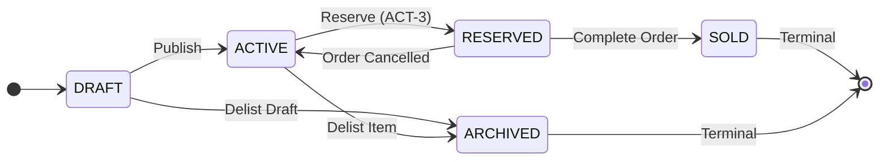
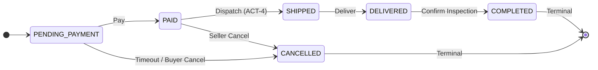

# PRD: Titife TechSwap (Secondhand Electronics Marketplace)

## 0. Locked Parameters
```text
MARKETPLACE_VERTICAL = secondhand electronics marketplace | CURRENCY = NGN (Kobo: 1 NGN = 100 Kobo)
STACK = TypeScript, Prisma, PostgreSQL | DEPLOYMENT_TARGET = Vercel + managed PostgreSQL
SHIPPING_MODEL = single-seller orders only | REVIEW_MODEL = buyer reviews completed order (1 review/order)
ROLE_MODEL = unified user model (buy and sell on single account)
```

### Companion Documents (schema truth)

This PRD is the intent and requirements document. Where implementation detail is concerned, these two
documents are authoritative because they are derived directly from `prisma/schema.prisma` and the
applied `migration.sql`, and verified against the live PostgreSQL catalog:

| Document | Covers | Referenced from |
| :--- | :--- | :--- |
| [`docs/erd.md`](./docs/erd.md) | Implemented ERD, all 11 named FK constraints with `ON DELETE` actions, primary-key register, uniqueness & check/trigger registers, enum domains, deletion strategy | [Section 2.2](#22-entity-cardinalities--mermaid-erd) |
| [`docs/order-state-machine.md`](./docs/order-state-machine.md) | Implemented `trg_order_status_check` trigger: full transition matrix, terminal states, forbidden transitions, `P0001` SQLSTATE, enforcement scope | [Section 3.3.2](#332-order-lifecycle) |

Source of truth for the deployed database, in priority order:
`prisma/migrations/20260927000000_init_techswap_schema/migration.sql` > `prisma/schema.prisma` > this PRD.

---

## 1. Requirements

### 1.1 Product, Problem & Scope
- **Product:** Peer-to-peer secondhand electronics marketplace in Nigeria.
- **Problem:** Double-selling of one-of-one items, post-checkout price mutations, and unverified seller reviews.
- **Users:** Unified `User` accounts acting as Buyers, Sellers, or Admins.
- **Scope:** One-of-one electronic listings, search/filtering, single-seller orders, tracking, and verified reviews.
- **Non-Goals:** Multi-seller carts, escrow payment webhooks, live peer-to-peer chat, physical repair services.

### 1.2 Five Primary User Actions

| Action Identifier | Action Name | User Role | Description |
| :--- | :--- | :--- | :--- |
| **ACT-1** | `CREATE_LISTING` | Seller | Publishes 1-of-1 electronics listing with specs, condition, and price in Kobo. |
| **ACT-2** | `SEARCH_AND_FILTER_LISTINGS` | Buyer / Guest | Queries active listings by category, brand, condition, and price with pagination. |
| **ACT-3** | `CREATE_ORDER` | Buyer | Purchases a single-seller listing, locking inventory via atomic DB transaction. |
| **ACT-4** | `FULFILL_ORDER` | Seller | Updates order lifecycle (`PAID` → `SHIPPED` → `DELIVERED`) with tracking info. |
| **ACT-5** | `SUBMIT_ORDER_REVIEW` | Buyer | Rates and reviews a verified `COMPLETED` order (1 review per order). |

---

## 2. Entity Model

### 2.1 Consolidated Entity Definitions & Fields

| Entity | Field | Type | Nullable | Default | Key / Constraint | Description |
| :--- | :--- | :--- | :---: | :--- | :--- | :--- |
| **User** | `id` | `String` (`TEXT`) | No | CUID2 | PK (`User_pkey`) | Non-sequential generated CUID2 ID |
| | `email`, `phoneNumber` | `String` (`TEXT`) | No | None | Unique (`User_email_key`, `User_phoneNumber_key`) | Auth & contact credentials |
| | `passwordHash`, `fullName` | `String` | No | None | None | Identity credentials |
| | `role` | `Enum` | No | `USER` | `USER \| ADMIN` | User privilege level |
| | `verifiedSeller` | `Boolean` | No | `false` | None | Seller verification badge |
| | `createdAt`, `updatedAt`, `deletedAt` | `DateTime` | Opt | `now()`, auto | Soft delete | Record lifecycle timestamps |
| **Category**| `id`, `name`, `slug` | `String` (`TEXT`) | No | CUID2 | PK (`Category_pkey`), Unique (`Category_name_key`, `Category_slug_key`) | Electronics taxonomy |
| | `description` | `String` | Yes | `null` | None | Category detail scope |
| **Listing** | `id` | `String` (`TEXT`) | No | CUID2 | PK (`Listing_pkey`) | Non-sequential generated CUID2 ID |
| | `sellerId`, `categoryId` | `String` (`TEXT`) | No | None | FK (`Listing_sellerId_fkey` -> `User`, `Listing_categoryId_fkey` -> `Category`), both `ON DELETE RESTRICT` | Owner & category references |
| | `title`, `brand`, `modelName` | `String` (`TEXT`) | No | None | None | Product metadata |
| | `description` | `String` (`TEXT`) | No | None | None | Narrative condition disclosure |
| | `condition` | `Enum` | No | None | `ItemCondition` | `FOR_PARTS, FAIR, GOOD, VERY_GOOD, LIKE_NEW, REFURBISHED` |
| | `specs` | `Json` (`JSONB`) | No | **None — no column default; `NOT NULL` enforced by column** | JSONB | Technical attributes (RAM, battery) |
| | `priceAmount` | `Int` (`INTEGER`) | No | None | `chk_listing_price_positive` (`priceAmount > 0`) | Price in NGN minor units (Kobo) |
| | `currency` | `String` (`TEXT`) | No | `'NGN'` | `chk_listing_price_positive` (`currency = 'NGN'`) | ISO-4217 currency code; stored as `TEXT`, **not** `VarChar(3)` |
| | `status` | `Enum` | No | `DRAFT` | `ListingStatus` | `DRAFT,ACTIVE,RESERVED,SOLD,ARCHIVED` |
| | `createdAt`, `updatedAt`, `deletedAt` | `DateTime` | Opt | `now()`, auto | Soft delete | Record lifecycle timestamps |
| **ListingImage**| `id`, `listingId`, `url` | `String` (`TEXT`) | No | CUID2 | PK (`ListingImage_pkey`), FK (`ListingImage_listingId_fkey` -> `Listing`, `ON DELETE CASCADE`) | Image asset URL (Cascade delete) |
| | `displayOrder` | `Int` (`INTEGER`) | No | `0` | None | Gallery ordering index |
| **Tag** | `id`, `name`, `slug` | `String` (`TEXT`) | No | CUID2 | PK (`Tag_pkey`), Unique (`Tag_name_key`, `Tag_slug_key`) | Descriptive tags (e.g. 5G, OLED) |
| **ListingTag**| `listingId`, `tagId` | `String` (`TEXT`) | No | None | Composite PK (`ListingTag_pkey` on `(listingId, tagId)`), FKs (`ListingTag_listingId_fkey`, `ListingTag_tagId_fkey`, both `ON DELETE CASCADE`) | N:M join table (Cascade delete) |
| | `createdAt`, `updatedAt` | `DateTime` (`TIMESTAMP(3)`) | No | `now()`, auto | None | Record lifecycle timestamps |
| **Order** | `id` | `String` (`TEXT`) | No | CUID2 | PK (`Order_pkey`) | Non-sequential generated CUID2 ID |
| | `orderNumber` | `String` (`TEXT`) | No | None | Unique (`Order_orderNumber_key`) | Human-facing order reference |
| | `buyerId` | `String` (`TEXT`) | No | None | FK (`Order_buyerId_fkey` -> `User`, `ON DELETE RESTRICT`) | Buyer reference; `chk_order_no_self_buy` |
| | `sellerId` | `String` (`TEXT`) | No | None | FK (`Order_sellerId_fkey` -> `User`, `ON DELETE RESTRICT`) | Seller reference; must equal `Listing.sellerId` (`trg_order_seller_match_check`) |
| | `listingId` | `String` (`TEXT`) | No | None | FK (`Order_listingId_fkey` -> `Listing`, `ON DELETE RESTRICT`); partial unique `idx_unique_active_order_per_listing` | Listing reference; 1-of-1 inventory invariant |
| | `status` | `Enum` | No | `PENDING_PAYMENT`| `OrderStatus` | `PENDING_PAYMENT, PAID, SHIPPED, DELIVERED, COMPLETED, CANCELLED` |
| | `subtotalAmount` | `Int` (`INTEGER`) | No | None | `chk_order_amounts` (`subtotalAmount >= 0`) | Contract price snapshot in Kobo |
| | `shippingFeeAmount` | `Int` (`INTEGER`) | No | `0` | `chk_order_amounts` (**`shippingFeeAmount >= 0`**) | Shipping fee in Kobo; must not be negative |
| | `totalAmount` | `Int` (`INTEGER`) | No | None | `chk_order_amounts` (`totalAmount = subtotalAmount + shippingFeeAmount`) | Charge total in Kobo |
| | `currency` | `String` (`TEXT`) | No | `'NGN'` | None | ISO-4217 currency code; stored as `TEXT`, **not** `VarChar(3)` |
| | `idempotencyKey` | `String` (`TEXT`) | No | None | Unique (`Order_idempotencyKey_key`) | Checkout retry safety |
| | `shippingAddress` | `Json` (`JSONB`) | No | **None — no column default; `NOT NULL` enforced by column** | JSONB | Address snapshot |
| | `trackingNumber`, `carrier` | `String` (`TEXT`) | Yes | `null` | None | Shipping tracking information |
| | `paidAt`..`cancelledAt`, `deletedAt` | `DateTime` | Yes | `null` | Soft delete | Lifecycle milestone timestamps |
| **Review** | `id` | `String` (`TEXT`) | No | CUID2 | PK (`Review_pkey`) | Non-sequential generated CUID2 ID |
| | `orderId` | `String` (`TEXT`) | No | None | FK (`Review_orderId_fkey` -> `Order`, `ON DELETE RESTRICT`); Unique (`Review_orderId_key`) | Enforces 1 : 1 `Order` ↔ `Review` |
| | `buyerId`, `sellerId` | `String` (`TEXT`) | No | None | FKs (`Review_buyerId_fkey`, `Review_sellerId_fkey` -> `User`, both `ON DELETE RESTRICT`) | Author & recipient references; must match the order (`trg_review_integrity_check`) |
| | `rating` | `Int` (`INTEGER`) | No | None | `chk_review_rating` (`rating >= 1 AND rating <= 5`) | Star rating |
| | `title`, `comment` | `String` (`TEXT`) | No | None | None | Rating & feedback text |

---

### 2.2 Entity Cardinalities & Mermaid ERD

> **Schema-truth companion:** [`docs/erd.md`](./docs/erd.md) is the authoritative implemented-schema
> relationship register (all 11 foreign-key constraints with their deployed names, per-edge `ON DELETE`
> actions, and the composite `ListingTag` primary key). This section summarises it; where the two differ,
> `docs/erd.md` and `migration.sql` are correct.

`User` participates in `Order` and `Review` through **four distinct foreign keys**, not two. Each is
listed separately below because each is an independently named constraint in PostgreSQL.

| # | Source Entity | Target Entity | FK Constraint (deployed name) | Child Column | Cardinality | ON DELETE | Description |
| :-- | :--- | :--- | :--- | :--- | :--: | :--- | :--- |
| 1 | `User` (Seller) | `Listing` | `Listing_sellerId_fkey` | `Listing.sellerId` | `1 : N` | `RESTRICT` | A seller owns multiple listings; rows are soft-deleted, never hard-deleted. |
| 2 | `Category` | `Listing` | `Listing_categoryId_fkey` | `Listing.categoryId` | `1 : N` | `RESTRICT` | A category contains multiple listings and must be emptied before hard delete. |
| 3 | `Listing` | `ListingImage` | `ListingImage_listingId_fkey` | `ListingImage.listingId` | `1 : N` | `CASCADE` | A listing features multiple images; hard delete of the listing removes them. |
| 4 | `Listing` | `Tag` | `ListingTag_listingId_fkey` + `ListingTag_tagId_fkey` | `ListingTag (listingId, tagId)` | `N : M` | `CASCADE` (both) | Explicit N:M join entity with composite PK `ListingTag_pkey`. |
| 5 | `User` (Buyer) | `Order` | `Order_buyerId_fkey` | `Order.buyerId` | `1 : N` | `RESTRICT` | A buyer purchases multiple orders. |
| 6 | `User` (Seller) | `Order` | `Order_sellerId_fkey` | `Order.sellerId` | `1 : N` | `RESTRICT` | A seller fulfils multiple orders. Distinct from #5. |
| 7 | `Listing` | `Order` | `Order_listingId_fkey` | `Order.listingId` | `1 : N` | `RESTRICT` | Max 1 **active** order via `idx_unique_active_order_per_listing`. |
| 8 | `Order` | `Review` | `Review_orderId_fkey` | `Review.orderId` | `1 : 0..1` | `RESTRICT` | At most 1 review per order (`Review_orderId_key`); a review exists only once the order is `COMPLETED`. |
| 9 | `User` (Buyer) | `Review` | `Review_buyerId_fkey` | `Review.buyerId` | `1 : N` | `RESTRICT` | The reviewing buyer. Must equal `Order.buyerId` (`trg_review_integrity_check`). |
| 10 | `User` (Seller) | `Review` | `Review_sellerId_fkey` | `Review.sellerId` | `1 : N` | `RESTRICT` | The reviewed seller. Must equal `Order.sellerId` (`trg_review_integrity_check`). |

**Cardinality notation (Mermaid):** `||` = exactly one (parent), `o{` = zero or many (child),
`o|` = zero or one.

```mermaid
erDiagram
    User ||--o{ Listing : "seller - Listing.sellerId (ON DELETE RESTRICT)"
    User ||--o{ Order : "buyer - Order.buyerId (ON DELETE RESTRICT)"
    User ||--o{ Order : "seller - Order.sellerId (ON DELETE RESTRICT)"
    User ||--o{ Review : "buyer - Review.buyerId (ON DELETE RESTRICT)"
    User ||--o{ Review : "seller - Review.sellerId (ON DELETE RESTRICT)"
    Category ||--o{ Listing : "categorizes - Listing.categoryId (ON DELETE RESTRICT)"
    Listing ||--o{ ListingImage : "contains - ListingImage.listingId (ON DELETE CASCADE)"
    Listing ||--o{ ListingTag : "has - ListingTag.listingId (ON DELETE CASCADE)"
    Tag ||--o{ ListingTag : "tagged by - ListingTag.tagId (ON DELETE CASCADE)"
    Listing ||--o{ Order : "purchased via - Order.listingId (ON DELETE RESTRICT)"
    Order ||--o| Review : "evaluated by - Review.orderId (ON DELETE RESTRICT)"

    User { string id PK "CUID2" }
    Category { string id PK "CUID2" }
    Listing { string id PK "CUID2" }
    ListingImage { string id PK "CUID2" }
    Tag { string id PK "CUID2" }
    ListingTag { string listingId PK,FK, string tagId PK,FK }
    Order { string id PK "CUID2" }
    Review { string id PK "CUID2" }
```

**Deleted — the 4 earlier design-phase edges this replaces:** `User -> Order "buyer/seller"`,
`User -> Review "buyer/seller"`, and the unlabeled `User -> Listing` / `Category -> Listing` edges.
The merged `"buyer/seller"` labels concealed four separately named constraints (#5, #6, #9, #10) and
omitted every `ON DELETE` action. See [`docs/erd.md`](./docs/erd.md) § Relationship Register.

---

## 3. Seven Hard Questions

### 3.1 Normalization & Deliberate Denormalizations
Source of truth tables: `User` (Identity), `Listing` (Current inventory/asking price), `Order` (Historical transaction price), `Review` (Ratings).

| Duplicated Field | Source of Truth | Reason & Business Justification | Consistency Strategy |
| :--- | :--- | :--- | :--- |
| `Order.subtotalAmount` | `Listing.priceAmount` | Listing prices change over time. Orders require an immutable contract price snapshot for accounting audits. | Written once during `CREATE_ORDER` transaction; never modified. |
| `Order.sellerId` & `Review.sellerId` | `Listing.sellerId` | Eliminates multi-table JOINs for seller dashboard queries and rating aggregations. Preserves attribution if listing is deleted. | Atomic write during order/review insertion. Immutable & verified via DB trigger `trg_order_seller_match_check`. |

---

### 3.2 Money Modeling
- **Rule:** Whole-number integer minor units (Kobo) paired with ISO-4217 currency (`'NGN'`). `Float`/`Decimal` strictly forbidden.
- **Fields:** `Listing.priceAmount`, `Order.subtotalAmount`, `Order.shippingFeeAmount`, `Order.totalAmount` (all integer Kobo). 250,000 NGN = `25000000` Kobo.

---

### 3.3 Status / State Machines & Database Enforcement

> **Trigger-level companions:**
> - Order lifecycle — [`docs/order-state-machine.md`](./docs/order-state-machine.md) is the authoritative
>   breakdown of the implemented `trg_order_status_check` trigger: the full 6 × 6 transition matrix,
>   the 24 forbidden transitions, the `P0001` SQLSTATE, and the enforcement-scope caveats (the trigger
>   is `BEFORE UPDATE OF status` only, so it does not fire on `INSERT`, and self-transitions are no-ops).
> - Listing lifecycle — no separate companion doc exists; the diagram below matches `trg_listing_status_check`
>   in `migration.sql` (lines 193–217).

#### 3.3.1 Listing Lifecycle


- **Allowed Transitions:** `DRAFT`→`ACTIVE`, `DRAFT`→`ARCHIVED`, `ACTIVE`→`RESERVED`, `ACTIVE`→`ARCHIVED`, `RESERVED`→`ACTIVE`, `RESERVED`→`SOLD`.
- **Terminal States:** `SOLD`, `ARCHIVED` (no transitions out).
- **Enforcement:** PL/pgSQL trigger `trg_listing_status_check`.

#### 3.3.2 Order Lifecycle


- **Allowed Transitions:** `PENDING_PAYMENT`→`PAID`, `PENDING_PAYMENT`→`CANCELLED`, `PAID`→`SHIPPED`, `PAID`→`CANCELLED`, `SHIPPED`→`DELIVERED`, `DELIVERED`→`COMPLETED`.
- **Terminal States:** `COMPLETED`, `CANCELLED` (no transitions out).
- **Enforcement:** PL/pgSQL trigger `trg_order_status_check`.

---

### 3.4 Time & Deletion Policy
Every table includes `createdAt` and `updatedAt`.

| Entity | Strategy | Technical & Business Rationale |
| :--- | :--- | :--- |
| `User`, `Listing`, `Order`, `Review` | **Soft Delete** (`deletedAt`) | Retains legal/financial audit trail and preserves foreign keys for completed orders while removing from UI. |
| `ListingImage`, `ListingTag`, `Category`, `Tag` | **Hard Delete** | Image URLs and tag junction rows are cascade deleted (`ON DELETE CASCADE`) to clean orphaned records. |

---

### 3.5 Identifiers Strategy
**Generated CUID2 non-sequential string IDs** (via `@paralleldrive/cuid2`).
- **Rationale:** Prevents URL sequential enumeration attacks (`/api/v1/orders/1004`), masks daily transaction volume from competitors, and supports distributed database scaling without central auto-increment sequence bottlenecks.

---

### 3.6 Database Constraints & Integrity Rules

#### 3.6.1 Constraint & Trigger Integrity Table

> Constraint, index, and trigger names below are the **actual deployed names** in PostgreSQL, verified
> against `pg_constraint` and `pg_indexes`. Earlier drafts of this document used invented
> `uq_*` aliases (`uq_user_email`, `uq_user_phone`, `uq_order_idempotency`, `uq_review_order`);
> those do not exist and have been replaced with the real `_key` index names.

| Table | Constraint / Trigger Name (deployed) | Type | Definition / Expression |
| :--- | :--- | :--- | :--- |
| `User` | `User_email_key`, `User_phoneNumber_key` | Unique | `UNIQUE (email)`, `UNIQUE (phoneNumber)` |
| `Category` | `Category_name_key`, `Category_slug_key` | Unique | `UNIQUE (name)`, `UNIQUE (slug)` |
| `Tag` | `Tag_name_key`, `Tag_slug_key` | Unique | `UNIQUE (name)`, `UNIQUE (slug)` |
| `Listing` | `chk_listing_price_positive` | Check | `CHECK (priceAmount > 0 AND currency = 'NGN')` |
| `Listing` | `trg_listing_status_check` | Trigger | `BEFORE UPDATE OF status`: Enforces `DRAFT->ACTIVE/ARCHIVED`, `ACTIVE->RESERVED/ARCHIVED`, `RESERVED->ACTIVE/SOLD`; `SOLD`/`ARCHIVED` terminal |
| `Order` | `chk_order_amounts` | Check | `CHECK (subtotalAmount >= 0 AND shippingFeeAmount >= 0 AND totalAmount = subtotalAmount + shippingFeeAmount)` — **all three terms are enforced; `shippingFeeAmount` may not be negative** |
| `Order` | `chk_order_no_self_buy` | Check | `CHECK (buyerId <> sellerId)` |
| `Order` | `Order_orderNumber_key` | Unique | `UNIQUE (orderNumber)` |
| `Order` | `Order_idempotencyKey_key` | Unique | `UNIQUE (idempotencyKey)` |
| `Order` | `idx_unique_active_order_per_listing` | Partial Unique | `CREATE UNIQUE INDEX ... ON "Order" ("listingId") WHERE status IN ('PENDING_PAYMENT','PAID','SHIPPED','DELIVERED','COMPLETED')` |
| `Order` | `trg_order_status_check` | Trigger | `BEFORE UPDATE OF status`: Enforces lifecycle hops (`PENDING_PAYMENT->PAID/CANCELLED`, etc.; `COMPLETED`/`CANCELLED` terminal) |
| `Order` | `trg_order_seller_match_check` | Trigger | `BEFORE INSERT`: Guarantees `Order.sellerId == Listing.sellerId` at purchase time |
| `Review` | `Review_orderId_key` | Unique | `UNIQUE (orderId)` — enforces 1 : 1 `Order` ↔ `Review` |
| `Review` | `chk_review_rating` | Check | `CHECK (rating >= 1 AND rating <= 5)` |
| `Review` | `trg_review_integrity_check` | Trigger | `BEFORE INSERT OR UPDATE`: Enforces order status = `COMPLETED` and matches `buyerId`/`sellerId` |

#### 3.6.2 Invalid State Prevention Mapping

> **Invalid State → Exact Preventing Constraint / Trigger**
1. **Duplicate active order on 1-of-1 listing:** Partial Unique Index `idx_unique_active_order_per_listing` (`23505 unique_violation`).
2. **Self-purchase (`buyerId == sellerId`):** Check Constraint `chk_order_no_self_buy` (`23514 check_violation`).
3. **Negative listing price:** Check Constraint `chk_listing_price_positive` (`23514 check_violation`).
4. **Negative shipping fee:** Check Constraint `chk_order_amounts` (`23514 check_violation`).
5. **Duplicate order review:** Unique Constraint `Review_orderId_key` (`23505 unique_violation`).
6. **Rating > 5:** Check Constraint `chk_review_rating` (`23514 check_violation`).
7. **Double-submit checkout retry:** Unique Key `Order_idempotencyKey_key` (`23505 unique_violation`).
8. **Invalid Listing status transition:** Trigger `trg_listing_status_check` (`P0001 raise_exception`).
9. **Invalid Order status transition:** Trigger `trg_order_status_check` (`P0001 raise_exception`).
10. **Review on non-COMPLETED order or mismatched buyer/seller:** Trigger `trg_review_integrity_check` (`P0001 raise_exception`).
11. **Order sellerId mismatch with Listing sellerId:** Trigger `trg_order_seller_match_check` (`P0001 raise_exception`).

#### 3.6.3 One-of-One Listing Inventory Invariant
- **Rule:** A secondhand listing cannot have > 1 active order or reservation under any concurrent condition.
- **Enforcement:** Transaction row locking (`SELECT ... FROM "Listing" WHERE id = $1 AND status = 'ACTIVE' FOR UPDATE;`) combined with PostgreSQL kernel index `idx_unique_active_order_per_listing`. Concurrent purchase attempts block on lock and fail status check or hit `23505 unique_violation`.

---

### 3.7 Targeted Indexing Plan

| Action | Access Pattern & SQL Query | Index Name | Index Definition | Technical Rationale |
| :--- | :--- | :--- | :--- | :--- |
| **ACT-1** | Seller active listing dashboard:<br>`WHERE sellerId = $1 AND status = 'ACTIVE'` | `idx_listing_seller_status` | `CREATE INDEX ON "Listing" ("sellerId", status, "createdAt" DESC) WHERE "deletedAt" IS NULL;` | Serves seller management views without indexing soft-deleted rows. |
| **ACT-2** | Public catalog search/filtering:<br>`WHERE categoryId = $1 AND condition = $2` | `idx_listing_search_filter` | `CREATE INDEX ON "Listing" ("categoryId", condition, "createdAt" DESC) WHERE status = 'ACTIVE' AND "deletedAt" IS NULL;` | Serves compound category & condition searches with ordering. |
| **ACT-3** | Active order inventory verification:<br>`INSERT INTO Order ...` | `idx_unique_active_order_per_listing` | `CREATE UNIQUE INDEX ON "Order" ("listingId") WHERE status IN ('PENDING_PAYMENT','PAID','SHIPPED','DELIVERED','COMPLETED');` | Guarantees 1-of-1 inventory invariant and instant active order lookup. |
| **ACT-4** | Seller fulfillment queue lookup:<br>`WHERE sellerId = $1 AND status = 'PAID'` | `idx_order_seller_status` | `CREATE INDEX ON "Order" ("sellerId", status, "createdAt" ASC) WHERE "deletedAt" IS NULL;` | Optimizes seller order dispatch queue sorted chronologically. |
| **ACT-5** | Seller public review feed & rating score:<br>`WHERE sellerId = $1` | `idx_review_seller_created` | `CREATE INDEX ON "Review" ("sellerId", "createdAt" DESC) WHERE "deletedAt" IS NULL;` | Serves public seller rating displays and star aggregations. |

---

## 4. API Design

### 4.1 Global JSON Error Envelope
```json
{
  "error": {
    "code": "INVENTORY_CONFLICT",
    "message": "Listing is no longer available.",
    "details": [{ "field": "listingId", "issue": "Active order exists." }],
    "timestamp": "2026-09-27T16:00:00Z",
    "requestId": "req_cuid2_12345"
  }
}
```

### 4.2 Endpoint Contracts

| Action | Method & Path | Auth | Key Request Fields | Success Code & Response | Error Codes | Idempotency |
| :--- | :--- | :--- | :--- | :--- | :--- | :--- |
| **ACT-1** | `POST /api/v1/listings` | User | `categoryId, title, brand, modelName, condition, specs, priceAmount, imageUrls` | `201 Created`<br>`{ data: { id, status: "DRAFT" } }` | `400` (Price<=0)<br>`401` (Unauth)<br>`404` (Cat) | Standard POST |
| **ACT-2** | `GET /api/v1/listings` | Public | Params: `page, limit, categoryId, brand, condition, minPrice, maxPrice, sortBy, sortOrder` | `200 OK`<br>`{ data: [...], pagination: { page, limit, totalItems } }` | `400` (Invalid pagination) | N/A (Read) |
| **ACT-3** | `POST /api/v1/orders` | Buyer | Header: `Idempotency-Key`<br>Body: `listingId, shippingFeeAmount, shippingAddress` | `201 Created`<br>`{ data: { id, orderNumber, status: "PENDING_PAYMENT", totalAmount } }` | `400` (Self-buy)<br>`409` (Conflict)<br>`422` (Idemp match) | Guaranteed via `Idempotency-Key` & `Order_idempotencyKey_key` |
| **ACT-4** | `PATCH /api/v1/orders/:id/fulfillment` | Seller | `status ("SHIPPED"\|"DELIVERED"), carrier, trackingNumber` | `200 OK`<br>`{ data: { id, status: "SHIPPED", trackingNumber } }` | `400` (Invalid state)<br>`403` (Not seller) | State conditional |
| **ACT-5** | `POST /api/v1/reviews` | Buyer | `orderId, rating (1..5), title, comment` | `201 Created`<br>`{ data: { id, orderId, rating } }` | `400` (Not completed)<br>`409` (Duplicate) | Unique `orderId` |

---

## 5. Over-Fetching & GraphQL Analysis
- **Scenario:** Mobile card view needing only `{ id, title, condition, priceAmount, currency, thumbnailUrl }`.
- **REST Over-Fetch:** Full `GET /api/v1/listings/:id` returns ~3.2 KB (seller object, full description, specs JSON, all images, tags). Client needs ~180 bytes.
- **GraphQL Alternative:** `query { listing(id: "...") { id title condition priceAmount currency primaryImage { url } } }`.
- **MVP Decision:** **Retain REST.** Allows Vercel CDN edge caching (`Cache-Control: s-maxage=60`), simpler tooling, and Prisma sparse selects (`prisma.listing.findMany({ select: { ... } })`).
- **Future Switch Triggers:** Native mobile apps requiring custom dynamic field masks across 20+ screens over low-bandwidth cellular networks, or public partner API.

---

## 6. Real-Time Analysis
- **Feature:** Live buyer order tracking notifications (`PENDING_PAYMENT` → `PAID` → `SHIPPED` → `DELIVERED`).
- **Comparison:**
  - *WebSockets:* Full-duplex. High overhead, complex serverless state management on Vercel.
  - *Server-Sent Events (SSE):* Unidirectional server-to-client HTTP/2 stream. Native browser auto-reconnect (`Last-Event-ID`), lightweight, Vercel edge compatible.
- **Decision:** **Server-Sent Events (SSE)**. Order status updates flow strictly unidirectional from server to client; no client upstream messaging required over stream.

---

## 7. Proof-of-Model Plan

### 7.1 Five Core SQL Queries
1. **ACT-1 (`CREATE_LISTING`):** `INSERT INTO "Listing" (id, "sellerId", "categoryId", title, description, brand, "modelName", condition, specs, "priceAmount", currency, status) VALUES (...);`
2. **ACT-2 (`SEARCH_AND_FILTER_LISTINGS`):** `SELECT id, title, brand, condition, "priceAmount" FROM "Listing" WHERE "categoryId" = $1 AND condition = $2 AND status = 'ACTIVE' ORDER BY "createdAt" DESC LIMIT 20;`
3. **ACT-3 (`CREATE_ORDER`):** `BEGIN; SELECT id FROM "Listing" WHERE id = $1 AND status = 'ACTIVE' FOR UPDATE; UPDATE "Listing" SET status = 'RESERVED' WHERE id = $1; INSERT INTO "Order" (id, "orderNumber", "buyerId", "sellerId", "listingId", status, "subtotalAmount", "totalAmount", "idempotencyKey") VALUES (...); COMMIT;`
4. **ACT-4 (`FULFILL_ORDER`):** `UPDATE "Order" SET status = 'SHIPPED', carrier = $1, "trackingNumber" = $2 WHERE id = $3 AND "sellerId" = $4 AND status = 'PAID';`
5. **ACT-5 (`SUBMIT_ORDER_REVIEW`):** `INSERT INTO "Review" (id, "orderId", "buyerId", "sellerId", rating, title, comment) VALUES (...);`

### 7.2 Two Heaviest Queries & Rationale
1. **ACT-2 (`SEARCH_AND_FILTER_LISTINGS`):** Heavy multi-attribute filtering + sorting query. High traffic volume; optimized via partial index `idx_listing_search_filter`.
2. **ACT-3 (`CREATE_ORDER`):** High-concurrency transaction with pessimistic row lock (`FOR UPDATE`) and unique index checks; optimized by short lock duration and kernel-level partial unique index.

### 7.3 Three Invalid Operations & Rejection Evidence
1. **Duplicate Order on 1-of-1 Listing:** `INSERT INTO "Order"` on reserved listing → Rejected by `idx_unique_active_order_per_listing` (`23505 unique_violation`).
2. **Rating > 5:** `INSERT INTO "Review"` with rating=6 → Rejected by `chk_review_rating` (`23514 check_violation`).
3. **Negative Price:** `INSERT INTO "Listing"` with priceAmount=-5000 → Rejected by `chk_listing_price_positive` (`23514 check_violation`).

---

## 8. Self-Grading Checklist

| Evaluation Criteria | Status | Section Reference |
| :--- | :---: | :--- |
| Requirements & 5 Actions | [x] | Section 1.2 (`ACT-1` to `ACT-5`) |
| Entities, Fields, Cardinalities & ERD | [x] | Section 2.1 (field table), Section 2.2 (cardinality table & Mermaid ERD); [`docs/erd.md`](./docs/erd.md) |
| Seven Hard Questions | [x] | Section 3 (3.1 to 3.7) |
| Two Deliberate Denormalizations | [x] | Section 3.1 (`Order.subtotalAmount`, `Order.sellerId`) |
| Integer Money (Kobo) + Currency | [x] | Section 3.2 (Int Kobo + NGN) |
| Lifecycle State Machine & Triggers | [x] | Section 3.3 (Mermaid diagrams & PL/pgSQL triggers); [`docs/order-state-machine.md`](./docs/order-state-machine.md) |
| Timestamps & Soft/Hard Deletion | [x] | Section 3.4 (Soft vs Hard delete table) |
| Non-sequential CUID2 Identifiers | [x] | Section 3.5 (Security & anti-scraping justification) |
| Database Constraints & 1-of-1 Invariant | [x] | Section 3.6 (Constraints table & partial unique index) |
| Action-Mapped Indexing Plan | [x] | Section 3.7 (5 targeted indexes mapped to ACT-1..5) |
| Versioned REST API & Idempotency | [x] | Section 4.1, 4.2 (`/api/v1/...`, error envelope, `Idempotency-Key`) |
| REST vs GraphQL Analysis | [x] | Section 5 (REST retained, MVP triggers defined) |
| Real-Time SSE Analysis | [x] | Section 6 (SSE selected over WebSockets) |
| Proof-of-Model Plan & Rejections | [x] | Section 7 (5 SQL queries, 2 heavy queries, 3 invalid rejections) |
| Defence Questions & Invariant Answer | [x] | Section 9 (4 core questions + quick answers) |

---

## 9. Defence Questions & Technical Responses

1. **Fact in two places & denormalization defence:** `Order.subtotalAmount` duplicates `Listing.priceAmount`. *Defence:* `Listing.priceAmount` is dynamic asking price; `Order.subtotalAmount` is historical contract price snapshot required for financial audit immutability.
2. **Second buyer 1-of-1 purchase attempt enforcement:** Prevented at DB kernel level by Partial Unique Index `CREATE UNIQUE INDEX idx_unique_active_order_per_listing ON Order(listingId) WHERE status IN ('PENDING_PAYMENT','PAID','SHIPPED','DELIVERED','COMPLETED')` combined with `SELECT ... FOR UPDATE` row locking. Secondary insert throws `23505 unique_violation`.
3. **Purchase-time price in order vs listing price:** Avoids historical accounting corruption if seller later edits asking price or discounts listing.
4. **Concrete trigger for GraphQL:** Launching mobile apps requiring dynamic field masking over low-bandwidth networks across 20+ screens, or public developer API.
5. **Quick-fire Answers:**
   - *Non-sequential IDs:* Prevents enumeration scraping & volume metric leakage (CUID2 generated).
   - *Integer money:* Eliminates IEEE 754 float rounding errors (Kobo = minor units).
   - *Targeted indexes:* Serves ACT-1..5 query patterns without indexing soft-deleted rows.
   - *Forbidden transition:* `PENDING_PAYMENT` → `COMPLETED` skips payment/logistics checks.
   - *Soft vs Hard delete:* Soft delete preserves financial logs; hard delete cleans media assets.
   - *Retries & Idempotency:* `Idempotency-Key` header mapped to `Order.idempotencyKey` unique index.
