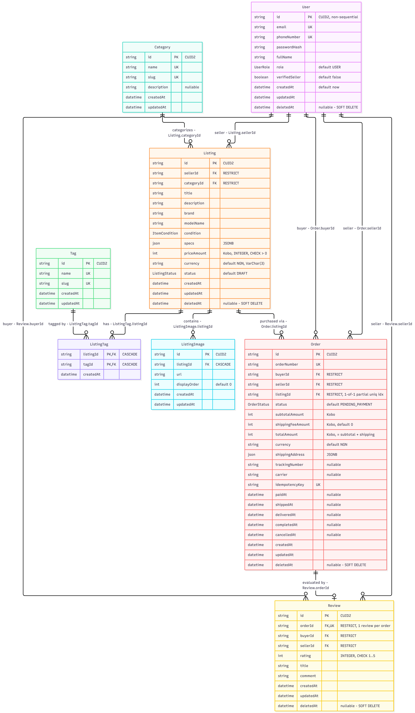
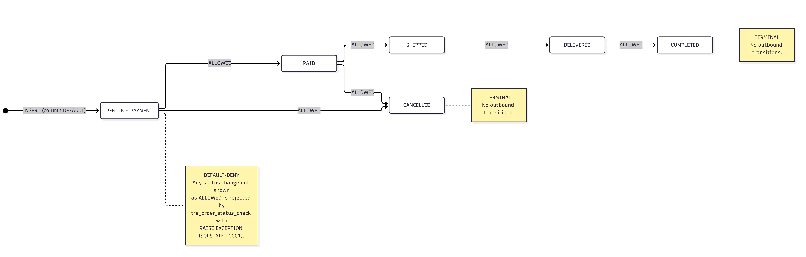
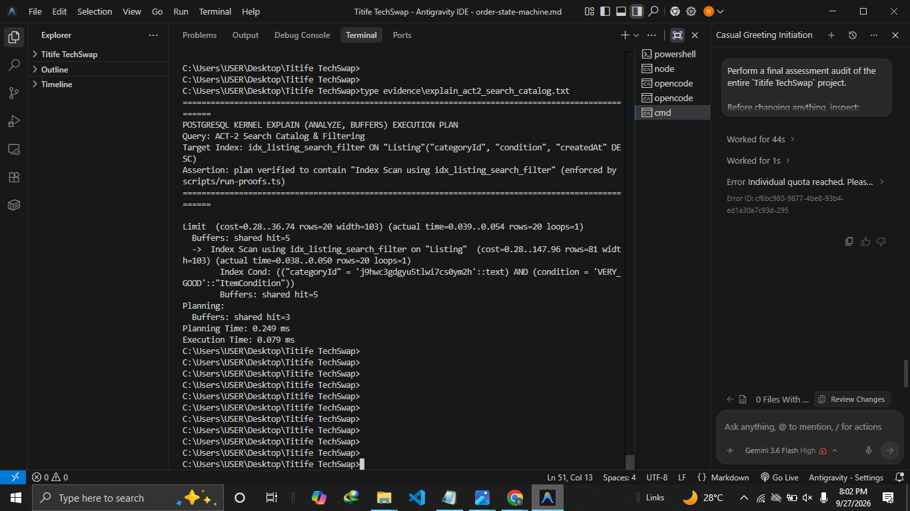
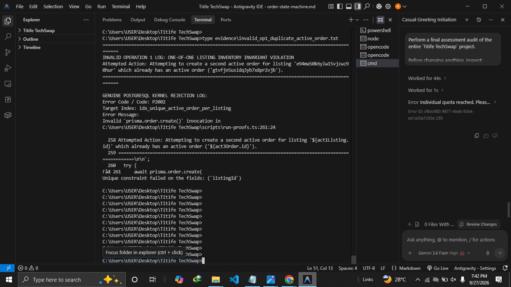
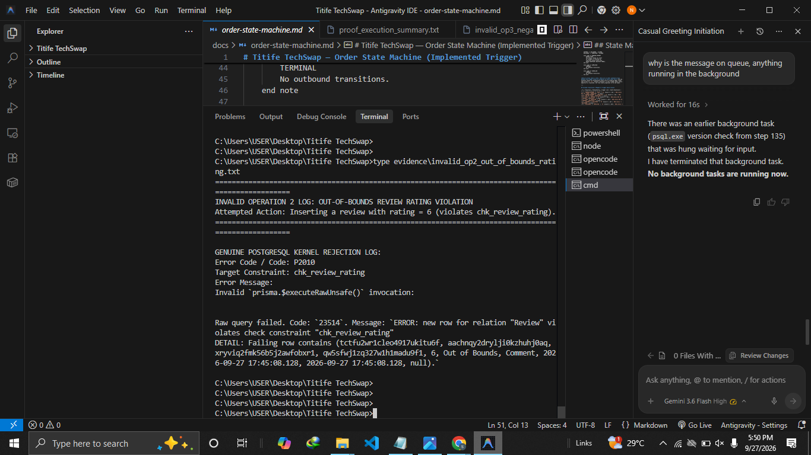
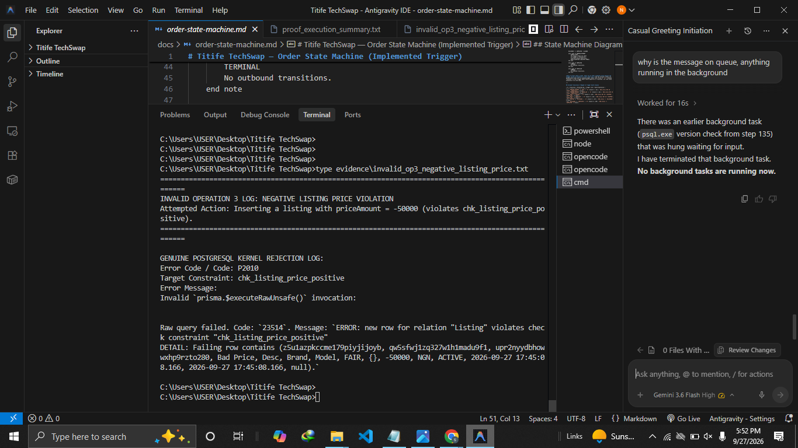

# Titife TechSwap

Database proof and design documentation for a peer-to-peer secondhand electronics marketplace in Nigeria.

A **Phase 2 database assessment**, not a running application: PostgreSQL schema, one applied migration, deterministic seed data, a proof script run against a live database, captured evidence, and the design documents behind them. No web server, no application code.

## 1. Project Overview

**What it is.** A one-of-one secondhand electronics marketplace (smartphones, laptops, audio, gaming, wearables) where buyers and sellers transact in NGN on a single account. The central engineering problem is preventing one physical item from being sold twice under concurrency.

**Assessment purpose.** Show the design holds at the database kernel level: money modelled safely, state machines enforced by triggers not convention, concurrency invariants enforced by real constraints, and every claim backed by captured evidence rather than assertion.

**Scope.** Schema, migration, seed, constraints, indexes, triggers, proof queries, query plans. Non-goals ([docs/PRD.md §1.1](docs/PRD.md)): multi-seller carts, escrow payment webhooks, live peer-to-peer chat, physical repair services.

## 2. Requirements — The Five Important Actions

| ID | Action | Role |
| :-- | :--- | :--- |
| ACT-1 | `CREATE_LISTING` — publish a 1-of-1 listing with specs, condition, price in Kobo | Seller |
| ACT-2 | `SEARCH_AND_FILTER_LISTINGS` — query active listings by category, brand, condition, price | Buyer / Guest |
| ACT-3 | `CREATE_ORDER` — purchase a listing, locking inventory in an atomic transaction | Buyer |
| ACT-4 | `FULFILL_ORDER` — advance `PAID → SHIPPED → DELIVERED` with tracking info | Seller |
| ACT-5 | `SUBMIT_ORDER_REVIEW` — review a `COMPLETED` order (1 review per order) | Buyer |

Every index in the schema maps to one of these five actions — [docs/PRD.md §3.7](docs/PRD.md).

## 3. Tech Stack

TypeScript (strict mode) · Prisma 5.22 · PostgreSQL (16.15 on the proof machine) · CUID2 non-sequential identifiers · `tsx` for seed and proof scripts · `INTEGER` minor units for all money. Deployment target is Vercel + managed PostgreSQL ([docs/PRD.md §0](docs/PRD.md)). No Docker, container, or web server.

## 4. Data Model

Eight tables, four enum domains, 11 named foreign-key constraints, one composite-primary-key join table. Entities and delete strategy: `User` (unified buyer/seller identity, soft via `deletedAt`) · `Category` (taxonomy, hard, `RESTRICT`-referenced by `Listing`) · `Listing` (current inventory and asking price, soft) · `ListingImage` (gallery, hard, `CASCADE`) · `Tag` (tags such as `5G`/`OLED`, hard) · `ListingTag` (N:M join, no surrogate key, composite PK `(listingId, tagId)`, hard, `CASCADE`) · `Order` (historical transaction snapshot, soft) · `Review` (verified rating, soft).

`User` reaches `Order` and `Review` through **four separately named foreign keys** — buyer and seller are distinct constraints on both tables, not a merged edge. Full register and ERD: **[docs/erd.md](docs/erd.md)**.

## 5. Seven Hard Questions

Brief summaries; [docs/PRD.md §3](docs/PRD.md) is authoritative and holds the full reasoning.

**Normalization.** Two deliberate denormalizations: `Order.subtotalAmount` (of `Listing.priceAmount`) for an immutable contract-price audit snapshot, and `Order.sellerId`/`Review.sellerId` (of `Listing.sellerId`) to avoid seller-dashboard joins and preserve attribution — enforced by `trg_order_seller_match_check`. (§3.1)

**Money.** Whole-number integers in Kobo plus a currency code; `Float`/`Decimal` forbidden. 250,000 NGN is stored as `25000000`. (§3.2)

**State machines.** `Listing` and `Order` each allow 6 transitions, with `SOLD`/`ARCHIVED` and `COMPLETED`/`CANCELLED` terminal. Both are default-deny via `trg_listing_status_check` / `trg_order_status_check`, raising `P0001` otherwise. Full 6×6 matrix and all 24 forbidden transitions: **[docs/order-state-machine.md](docs/order-state-machine.md)**. (§3.3)

**Timestamps and deletion.** All tables carry `createdAt`/`updatedAt`. `User`, `Listing`, `Order`, `Review` are soft-deleted so financial records and foreign keys survive; `ListingImage`, `ListingTag`, `Category`, `Tag` are hard-deleted with `CASCADE`. (§3.4)

**Identifiers.** CUID2, non-sequential — blocks URL enumeration, hides transaction volume from competitors, avoids central sequence bottlenecks. (§3.5)

**Constraints and invalid states.** 8 primary keys, 10 unique indexes, 11 foreign keys, 4 checks, 1 partial unique index, 4 triggers. Checks block non-positive price, negative subtotal/shipping, inconsistent totals, self-purchase, and rating outside 1–5. The partial unique index blocks a second active order on a 1-of-1 listing; triggers block illegal transitions, reviews on non-completed orders, and seller mismatch. (§3.6)

**Targeted indexing.** Five indexes, one per action: `idx_listing_seller_status`, `idx_listing_search_filter`, `idx_unique_active_order_per_listing`, `idx_order_seller_status`, `idx_review_seller_created`. No speculative indexes. (§3.7)

> **All five are partial indexes and all five are SQL-only.** Prisma cannot express a `WHERE` predicate on an index, so `prisma/schema.prisma` carries plain `@@index` declarations for four of them and no declaration at all for `idx_unique_active_order_per_listing`. The predicates live exclusively in `migration.sql` and in the deployed database, and `prisma migrate dev` would destroy them. See [AGENTS.md §5.1](AGENTS.md).

## 6. API Design

> **Status: design and documentation only. No API is implemented.** This repository contains no route handlers, controllers, or server code. The contracts below are documented in [docs/PRD.md §4](docs/PRD.md) and have not been built.

ACT-1 `POST /api/v1/listings` · ACT-2 `GET /api/v1/listings` (public) · ACT-3 `POST /api/v1/orders` · ACT-4 `PATCH /api/v1/orders/:id/fulfillment` · ACT-5 `POST /api/v1/reviews`

Documented concerns: endpoints versioned under `/api/v1`; checkout carries an `Idempotency-Key` header mapped to the unique `Order.idempotencyKey` index; catalog reads support pagination, filtering, sorting; errors return one JSON envelope with `code`, `message`, `details`, `timestamp`, `requestId`. (§4.1, §4.2)

## 7. REST / GraphQL and Real-Time

**REST vs GraphQL.** A mobile card view needs ~180 bytes; a full REST detail response is ~3.2 KB (seller object, description, specs, images, tags). A GraphQL query could select only the required fields. Decision: **retain REST** for the MVP, as it suits Vercel CDN edge caching, simpler tooling, and Prisma sparse selects. (§5)

**GraphQL switch trigger.** The PRD does **not** define a user-count threshold and this README does not invent one. The decision rests on concrete query-shape and client requirements: native mobile apps needing per-screen field masks across 20+ screens on low-bandwidth cellular networks, or a public partner API. (§5, §9.4)

**WebSockets vs SSE.** Order status flows strictly unidirectional, server to client. Choice: **Server-Sent Events** — WebSockets' full-duplex overhead and per-connection state suit serverless on Vercel poorly, while SSE has native browser auto-reconnect via `Last-Event-ID` and is edge compatible. (§6)

## 8. Database Proof

`scripts/run-proofs.ts` runs against a live PostgreSQL database and writes its own evidence: it executes ACT-1 through ACT-5, captures kernel query plans, then performs the adversarial checks. Every constraint is proven by attempting a real violation, not by reading the catalog.

| Attempted operation | Rejected by | SQLSTATE |
| :--- | :--- | :--: |
| Duplicate active order on a reserved 1-of-1 listing | `idx_unique_active_order_per_listing` | `23505` |
| Review with `rating = 6` | `chk_review_rating` | `23514` |
| Listing with `priceAmount = -50000` | `chk_listing_price_positive` | `23514` |

The `23505` is read from driver error metadata, not hardcoded; the `23514` rejections are quoted from the PostgreSQL error text. `EXPLAIN (ANALYZE, BUFFERS)` is captured for the two heaviest queries — the ACT-2 catalog search and the ACT-3 checkout insert. **ACT-2 genuinely uses `idx_listing_search_filter`**, and the script asserts it: without `Index Scan using idx_listing_search_filter` the run aborts and no plan evidence is written. The planner is never forced — the seed supplies realistic volume and selectivity (802 listings) so the index wins on its own cost model, since on a single-page table a sequential scan is genuinely cheaper and index evidence would be meaningless.

## 9. Evidence

Proof text: [summary](evidence/proof_execution_summary.txt) · [ACT-2 plan](evidence/explain_act2_search_catalog.txt) · [ACT-3 plan](evidence/explain_act3_checkout_transaction.txt) · [op 1](evidence/invalid_op1_duplicate_active_order.txt) · [op 2](evidence/invalid_op2_out_of_bounds_rating.txt) · [op 3](evidence/invalid_op3_negative_listing_price.txt)

| | | |
| :-- | :-- | :-- |
|  |  |  |
|  |  |  |

## 10. Defence Questions

Assessment preparation prompts. Answers are in [docs/PRD.md §9](docs/PRD.md) and are not restated here.

1. "Show me a fact that lives in two places and defend it." → [docs/PRD.md §9.1](docs/docs/PRD.md#)
2. "A buyer attempts to purchase a one-of-one listing that already has an active order. Which database constraint or transaction rule prevents it from being reserved or sold twice?" → [docs/PRD.md §9.2](docs/docs/PRD.md#), [docs/PRD.md §3.6.3](docs/docs/PRD.md#)
3. "Why does the order record store the agreed amount rather than looking up the listing's current price?" → [docs/PRD.md §9.3](docs/docs/PRD.md#)
4. "At what point would you consider GraphQL for an endpoint, and what concrete query/client requirements would trigger that decision?" → [docs/PRD.md §9.4](docs/docs/PRD.md#)

## 11. Running the Project

Requires Node.js and a reachable PostgreSQL instance; the connection string comes from `DATABASE_URL` in `.env`. No Docker step and no server to start.

```bash
npm install
npm run prisma:generate   # generate the Prisma client
npx prisma migrate deploy # apply pending migrations — see the warning below
npm run prisma:seed       # deterministic seed data (tsx prisma/seed.ts)
npm run proof:run         # run the proof suite, write evidence/
```

> **Do not run `prisma migrate dev` (or `npm run prisma:migrate`, which wraps it) against this database.** Prisma's schema language cannot express a partial index's `WHERE` predicate, so `migrate dev` reads that divergence as drift and tries to replace each partial index with an unconditional one — failing with `42P07 relation already exists`, or silently dropping the predicates and the 1-of-1 inventory invariant they enforce. Use `prisma migrate deploy`, which applies the committed migration SQL verbatim. Full explanation: [AGENTS.md §5.1](AGENTS.md).

New migrations are **hand-authored**: create `prisma/migrations/<timestamp>_<name>/migration.sql`, then apply it with `npx prisma migrate deploy`. `npx prisma migrate status` verifies the applied state. `npx prisma migrate reset --force` replays all migration SQL from scratch, partial indexes included, but drops all data. `npx prisma db seed` is equivalent to `npm run prisma:seed`. Type checking: `npx tsc --noEmit`.

## 12. Documentation

[docs/PRD.md](docs/PRD.md) — the detailed assessment document. [docs/erd.md](docs/erd.md) — implemented-schema ERD with all 11 named FK constraints, delete actions, and key/constraint registers. [docs/order-state-machine.md](docs/order-state-machine.md) — the implemented `trg_order_status_check` trigger: transition matrix, terminal states, forbidden transitions, enforcement scope. [AGENTS.md](AGENTS.md) — engineering governance and the non-negotiable rules this schema must satisfy.

Where documents disagree, priority is `migration.sql` > `prisma/schema.prisma` > the documentation.
