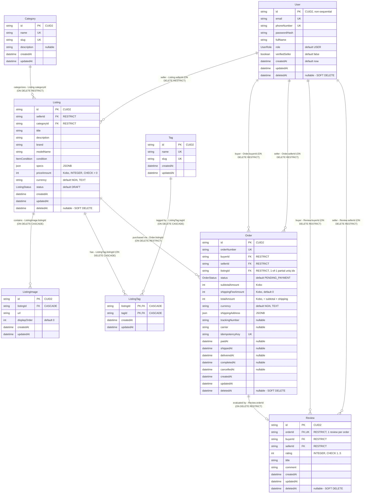

# Titife TechSwap — Database Relationship Diagram (Implemented Schema)

**Status:** Reflects the **final implemented schema**, not a design draft.
**Derived strictly from:**
- `prisma/schema.prisma` (179 lines)
- `prisma/migrations/20260927000000_init_techswap_schema/migration.sql` (316 lines, applied)

**Scope:** 8 tables, 4 enum domains, 11 foreign-key constraints, 1 composite-primary-key join table.
**No relationship, column, key, or referential action below is inferred — every element is present in the sources named above.**

---

## Entity-Relationship Diagram



---

## Relationship Register (all 11 FK constraints)

| # | Constraint Name | Child Column | Parent Column | Cardinality | ON DELETE | Strategy |
| :-- | :--- | :--- | :--- | :---: | :--- | :--- |
| 1 | `Listing_sellerId_fkey` | `Listing.sellerId` | `User.id` | 1 : N | `RESTRICT` | Soft delete |
| 2 | `Listing_categoryId_fkey` | `Listing.categoryId` | `Category.id` | 1 : N | `RESTRICT` | Hard delete blocked |
| 3 | `ListingImage_listingId_fkey` | `ListingImage.listingId` | `Listing.id` | 1 : N | `CASCADE` | Hard delete |
| 4 | `ListingTag_listingId_fkey` | `ListingTag.listingId` | `Listing.id` | 1 : N | `CASCADE` | Hard delete |
| 5 | `ListingTag_tagId_fkey` | `ListingTag.tagId` | `Tag.id` | 1 : N | `CASCADE` | Hard delete |
| 6 | `Order_buyerId_fkey` | `Order.buyerId` | `User.id` | 1 : N | `RESTRICT` | Soft delete |
| 7 | `Order_sellerId_fkey` | `Order.sellerId` | `User.id` | 1 : N | `RESTRICT` | Soft delete |
| 8 | `Order_listingId_fkey` | `Order.listingId` | `Listing.id` | 1 : N | `RESTRICT` | Soft delete |
| 9 | `Review_orderId_fkey` | `Review.orderId` | `Order.id` | 1 : 0..1 | `RESTRICT` | Soft delete |
| 10 | `Review_buyerId_fkey` | `Review.buyerId` | `User.id` | 1 : N | `RESTRICT` | Soft delete |
| 11 | `Review_sellerId_fkey` | `Review.sellerId` | `User.id` | 1 : N | `RESTRICT` | Soft delete |

**Cardinality notation:** `||` = exactly one (parent), `o{` = zero or many (child), `o|` = zero or one.

---

## Primary Key Register

| Entity | Primary Key | Notes |
| :--- | :--- | :--- |
| `User` | `id` | CUID2, `TEXT` |
| `Category` | `id` | CUID2, `TEXT` |
| `Listing` | `id` | CUID2, `TEXT` |
| `ListingImage` | `id` | CUID2, `TEXT` |
| `Tag` | `id` | CUID2, `TEXT` |
| **`ListingTag`** | **composite `(listingId, tagId)`** | **N:M join entity — no surrogate `id`** |
| `Order` | `id` | CUID2, `TEXT` |
| `Review` | `id` | CUID2, `TEXT` |

---

## N:M Relationship — Resolved via `ListingTag`

```
Listing  1 ────< ListingTag >──── 1  Tag
                 (composite PK)
```

`ListingTag` is the **only** N:M bridge. It exists solely to resolve `Listing` ↔ `Tag` (e.g. `5G`, `OLED`). It has no surrogate key and no `deletedAt`; it carries the standard `createdAt`/`updatedAt` audit pair, as does every other entity in the schema; both FKs cascade so junction rows cannot outlive either parent. No other entity in the schema is a join table.

---

## Uniqueness Beyond Primary Keys

| Index Name | Table | Definition | Governs |
| :--- | :--- | :--- | :--- |
| `User_email_key` | `User` | `UNIQUE (email)` | Auth identity |
| `User_phoneNumber_key` | `User` | `UNIQUE (phoneNumber)` | Contact identity |
| `Category_name_key` | `Category` | `UNIQUE (name)` | Taxonomy |
| `Category_slug_key` | `Category` | `UNIQUE (slug)` | URL key |
| `Tag_name_key` | `Tag` | `UNIQUE (name)` | Tag identity |
| `Tag_slug_key` | `Tag` | `UNIQUE (slug)` | URL key |
| `Order_orderNumber_key` | `Order` | `UNIQUE (orderNumber)` | Human-facing reference |
| `Order_idempotencyKey_key` | `Order` | `UNIQUE (idempotencyKey)` | Checkout retry safety (ACT-3) |
| `Review_orderId_key` | `Review` | `UNIQUE (orderId)` | **Enforces 1 : 1 `Order` ↔ `Review`** (ACT-5) |
| `idx_unique_active_order_per_listing` | `Order` | `UNIQUE (listingId) WHERE status IN ('PENDING_PAYMENT','PAID','SHIPPED','DELIVERED','COMPLETED')` | **Enforces the 1-of-1 listing inventory invariant** (ACT-3) |

---

## Referential Integrity Beyond Uniqueness

| Constraint / Trigger | Type | Table | Purpose |
| :--- | :--- | :--- | :--- |
| `chk_listing_price_positive` | Check | `Listing` | `priceAmount > 0 AND currency = 'NGN'` |
| `chk_order_amounts` | Check | `Order` | `subtotalAmount >= 0 AND shippingFeeAmount >= 0 AND totalAmount = subtotalAmount + shippingFeeAmount` |
| `chk_order_no_self_buy` | Check | `Order` | `buyerId <> sellerId` |
| `chk_review_rating` | Check | `Review` | `rating BETWEEN 1 AND 5` |
| `trg_listing_status_check` | Trigger | `Listing` | Enforces `ListingStatus` transitions |
| `trg_order_status_check` | Trigger | `Order` | Enforces `OrderStatus` transitions |
| `trg_review_integrity_check` | Trigger | `Review` | Order must be `COMPLETED`; `buyerId`/`sellerId` must match the order |
| `trg_order_seller_match_check` | Trigger | `Order` | `Order.sellerId` must equal `Listing.sellerId` at purchase time |

---

## Enum Domains

| Enum Type | Values |
| :--- | :--- |
| `UserRole` | `USER`, `ADMIN` |
| `ItemCondition` | `FOR_PARTS`, `FAIR`, `GOOD`, `VERY_GOOD`, `LIKE_NEW`, `REFURBISHED` |
| `ListingStatus` | `DRAFT`, `ACTIVE`, `RESERVED`, `SOLD`, `ARCHIVED` |
| `OrderStatus` | `PENDING_PAYMENT`, `PAID`, `SHIPPED`, `DELIVERED`, `COMPLETED`, `CANCELLED` |

---

## Deletion Strategy (relationship-level consequence)

| Strategy | Entities | Effect on relationships |
| :--- | :--- | :--- |
| **Soft Delete** (`deletedAt`) | `User`, `Listing`, `Order`, `Review` | Incoming FKs use `ON DELETE RESTRICT`; rows are retained so historical orders and reviews keep valid parent references. |
| **Hard Delete** | `ListingImage`, `ListingTag`, `Category`, `Tag` | `ListingImage` and `ListingTag` use `ON DELETE CASCADE` (orphans cleaned automatically). `Category` is `RESTRICT`-referenced by `Listing` and must be emptied first. |

---

## Relationship to `PRD.md` §2.2

`PRD.md` §2.2 ("Entity Cardinalities & Mermaid ERD") **now mirrors this file.** Its cardinality table
lists all 10 relationship rows with the same deployed FK constraint names and the same `ON DELETE`
actions, and its Mermaid block uses the same 11 labelled edges.

This file previously superseded a design-phase diagram in `PRD.md` that collapsed four distinct FK
constraints into two edges (`User -> Order` and `User -> Review` each merged `buyer` and `seller` into
a single `"buyer/seller"` label) and omitted all `ON DELETE` referential actions, the composite
`ListingTag` primary key, and the soft/hard delete split. Those PRD errors have been corrected against
this file; every relationship in both documents is traceable to a named constraint in `migration.sql`.

`PRD.md` §2.2 links here, and both documents link to
[`order-state-machine.md`](./order-state-machine.md) for the implemented `trg_order_status_check` trigger.
