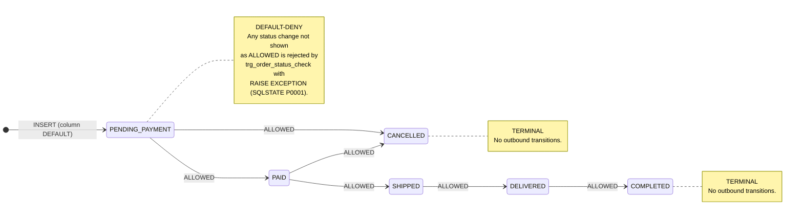

# Titife TechSwap — Order State Machine (Implemented Trigger)

**Status:** Reflects the **implemented database trigger**, not design intent.
**Single source of truth:**
`prisma/migrations/20260927000000_init_techswap_schema/migration.sql` **lines 222–249**

```text
CREATE OR REPLACE FUNCTION enforce_order_status_transition()   -- line 222
CREATE TRIGGER trg_order_status_check                          -- line 247
BEFORE UPDATE OF status ON "Order" FOR EACH ROW                 -- line 248
```

**Enum domain** (`migration.sql` line 11): `PENDING_PAYMENT`, `PAID`, `SHIPPED`, `DELIVERED`, `COMPLETED`, `CANCELLED` — 6 states.
**Nothing below is inferred. Every allowed transition maps to a numbered guard clause, and every forbidden transition is mechanically derived from those clauses.**

---

## State Machine Diagram



**Only 6 arrows leave a state. There are no other outbound arrows because the trigger raises an exception on every other one.** The two terminal states are deliberately drawn with no outgoing edges rather than arrows to `[*]`, because "terminal" in this trigger means *every departure is rejected*, not *the state progresses to an end node*.

---

## Allowed Transitions — Mapped to Trigger Guard Clauses

| # | Transition | Permitted By | Trigger Line | Guard Expression |
| :-- | :--- | :--- | :--: | :--- |
| 1 | `PENDING_PAYMENT` → `PAID` | `IF` branch 3 | 231 | `NEW.status NOT IN ('PAID','CANCELLED')` → raise |
| 2 | `PENDING_PAYMENT` → `CANCELLED` | `IF` branch 3 | 231 | `NEW.status NOT IN ('PAID','CANCELLED')` → raise |
| 3 | `PAID` → `SHIPPED` | `IF` branch 4 | 234 | `NEW.status NOT IN ('SHIPPED','CANCELLED')` → raise |
| 4 | `PAID` → `CANCELLED` | `IF` branch 4 | 234 | `NEW.status NOT IN ('SHIPPED','CANCELLED')` → raise |
| 5 | `SHIPPED` → `DELIVERED` | `IF` branch 5 | 237 | `NEW.status != 'DELIVERED'` → raise |
| 6 | `DELIVERED` → `COMPLETED` | `IF` branch 6 | 240 | `NEW.status != 'COMPLETED'` → raise |

Each branch is **default-deny**: it raises unless `NEW.status` is in the listed target set.

---

## Terminal States

| State | Guard | Trigger Line | Effect |
| :--- | :--- | :--: | :--- |
| `COMPLETED` | `IF OLD.status IN ('COMPLETED','CANCELLED')` | 228–230 | Any change away from `COMPLETED` raises `Forbidden state transition: Order status COMPLETED is terminal.` |
| `CANCELLED` | `IF OLD.status IN ('COMPLETED','CANCELLED')` | 228–230 | Any change away from `CANCELLED` raises `Forbidden state transition: Order status CANCELLED is terminal.` |

The terminal guard is evaluated **before** the per-state guards, so `COMPLETED → CANCELLED` and `CANCELLED → COMPLETED` are both rejected even though each names an otherwise-existing state.

---

## All Other Transitions Are Forbidden — Full Matrix

6 states × 6 states. Non-self transitions total **30**: **6 ALLOWED** + **24 FORBIDDEN**.
`—` marks a self-transition, which is a no-op explicitly permitted by line 225 (`IF OLD.status = NEW.status THEN RETURN NEW`) and is not a transition.

| From \ To | `PENDING_PAYMENT` | `PAID` | `SHIPPED` | `DELIVERED` | `COMPLETED` | `CANCELLED` |
| :--- | :---: | :---: | :---: | :---: | :---: | :---: |
| **`PENDING_PAYMENT`** | — | **ALLOWED** | FORBIDDEN | FORBIDDEN | FORBIDDEN | **ALLOWED** |
| **`PAID`** | FORBIDDEN | — | **ALLOWED** | FORBIDDEN | FORBIDDEN | **ALLOWED** |
| **`SHIPPED`** | FORBIDDEN | FORBIDDEN | — | **ALLOWED** | FORBIDDEN | FORBIDDEN |
| **`DELIVERED`** | FORBIDDEN | FORBIDDEN | FORBIDDEN | — | **ALLOWED** | FORBIDDEN |
| **`COMPLETED`** | FORBIDDEN | FORBIDDEN | FORBIDDEN | FORBIDDEN | — | FORBIDDEN |
| **`CANCELLED`** | FORBIDDEN | FORBIDDEN | FORBIDDEN | FORBIDDEN | FORBIDDEN | — |

**Forbidden transition count by origin:** `PENDING_PAYMENT` 3 · `PAID` 3 · `SHIPPED` 4 · `DELIVERED` 4 · `COMPLETED` 5 · `CANCELLED` 5 = **24**.

Guard coverage is exhaustive: the trigger's branches cover `PENDING_PAYMENT`, `PAID`, `SHIPPED`, `DELIVERED` (lines 231, 234, 237, 240) plus the terminal pair `COMPLETED`, `CANCELLED` (line 228). That is all 6 enum values, so **no status can slip through unguarded**.

---

## Rejection Behaviour

| Property | Value | Source |
| :--- | :--- | :--- |
| Mechanism | `RAISE EXCEPTION` in PL/pgSQL | lines 229, 232, 235, 238, 241 |
| SQLSTATE | `P0001` (`raise_exception`) — no explicit `ERRCODE` is supplied, so PostgreSQL applies the default | lines 222–245 |
| Message pattern | `Forbidden state transition from <OLD> to <NEW>` | lines 232, 235, 238, 241 |
| Terminal message pattern | `Forbidden state transition: Order status <OLD> is terminal.` | line 229 |
| Failure mode | Transaction aborts; the `UPDATE` is not applied | PostgreSQL |

---

## Enforcement Scope & Caveats

Read directly from the trigger definition — these bound what the diagram guarantees.

1. **Updates only, not inserts.** The trigger is `BEFORE UPDATE OF status` (line 248). It does **not** fire on `INSERT`, so the initial `status` of a new row is constrained only by the column `DEFAULT 'PENDING_PAYMENT'` (`schema.prisma` line 136) — not by this trigger. The `[*] → PENDING_PAYMENT` entry arrow reflects that column default, not the trigger.
2. **Self-transitions are no-ops, not transitions.** Line 225 returns early when `OLD.status = NEW.status`, so e.g. `PAID → PAID` and even `COMPLETED → COMPLETED` are accepted without error. This is why self-transitions are marked `—` above rather than `ALLOWED`.
3. **Column-targeted.** `UPDATE OF status` means the trigger fires only when the statement's `SET` list includes `status`. Updates to other columns (e.g. `carrier`, `trackingNumber`) do not fire it.
4. **No `BEFORE INSERT` sibling.** Unlike `trg_order_seller_match_check` (line 314), which is `BEFORE INSERT`, this trigger has no insert-time counterpart.

---

## Relationship to `PRD.md` §3.3.2

`PRD.md` §3.3.2 ("Order Lifecycle") contains the design-phase Order lifecycle diagram. Its 6 allowed
transitions and its terminal-state list are **identical to the implemented trigger** — I found no
discrepancy. This file differs in presentation only:

- It marks the 2 terminal states by **absence of outbound edges** rather than `COMPLETED --> [*]` / `CANCELLED --> [*]`, which reads as "progresses to an end node" rather than "any departure is rejected".
- It states the **default-deny** rule on the diagram itself, instead of leaving it implicit in the 6 arrows.
- It enumerates all **24 forbidden** transitions, which the design diagram does not.
- It annotates the **enforcement scope** (insert bypass, self-transition no-op) and the `P0001` SQLSTATE.
- It drops PRD's transition labels (`Pay`, `Timeout / Buyer Cancel`, `Dispatch (ACT-4)`, `Seller Cancel`, `Deliver`, `Confirm Inspection`), which are product intent and do not appear in the trigger body.
